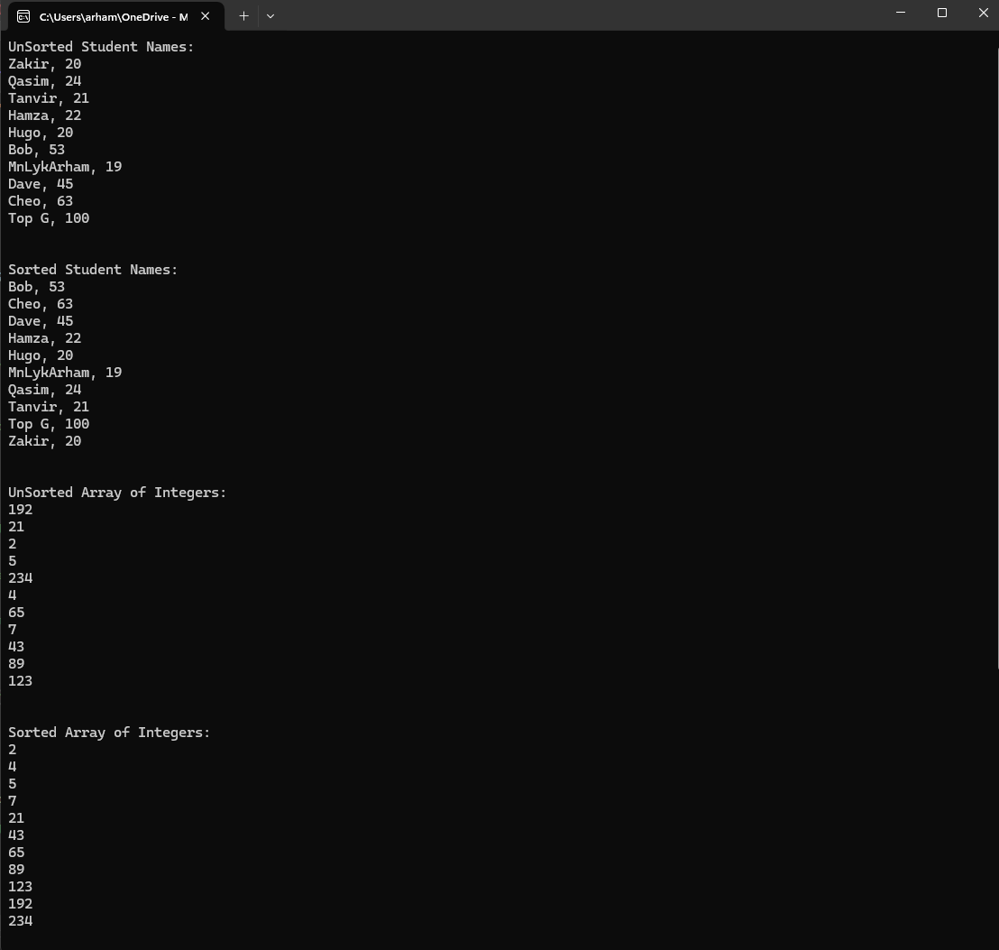

# 🔄 Generic Sorting Application

## 🚀 Project Overview and Learning Outcomes

In this project, I developed a **generic implementation** of the **selection sort algorithm** in C#. This application not only sorts arrays of integers but also handles custom **Student objects**, showcasing the flexibility of **generics** in C#. By utilising **generics** and the **IComparable** interface, I created a reusable sorting function that efficiently handles multiple data types. This project highlights key concepts in **algorithmic design**, particularly sorting techniques, while emphasising flexibility and efficiency. 💡

---

## ✨ Features

- **Generic Sorting**: A flexible selection sort algorithm that works with various data types.
- **Custom Object Handling**: Sorts custom objects (like Student objects) based on specific attributes.
- **Reusability**: The code is adaptable and scalable thanks to the use of generics.
- **Efficiency**: Demonstrates the efficiency of the selection sort for different datasets.

---

## 🛠️ How to Use

1. **Sorting Students**: 
   - Automatically sorts Student objects by their names using a generic selection sort.
   - Displays the list before and after sorting.
   
2. **Sorting Integers**:
   - A sample integer array is sorted using the same generic sorting method.

---

### 📊 Example Usage

- Input student names and ages: `"Alice, 21"`, `"Bob, 19"`.
- The application sorts students alphabetically.

**Expected Output**:  
`"Alice, 21"`, `"Bob, 19"` (sorted by name).

---

## 📸 Screenshots

---

## 🏆 Achievements

Through this project, I deepened my understanding of **sorting algorithms**, particularly the **selection sort**, and explored how **generics** in C# can be leveraged for adaptability. By applying sorting algorithms to both integers and custom objects, I sharpened my ability to create **versatile, reusable code**. This project also helped me appreciate the importance of **algorithmic efficiency**, especially in diverse use cases.

---

## 🌟 Overall

Developing this **Generic Sorting Application** allowed me to bridge theory with practice, combining fundamental algorithmic concepts with practical, real-world application. It was a rewarding challenge to write efficient, reusable code capable of handling various data types, reinforcing the value of **generic programming** and sorting algorithms. 📈
